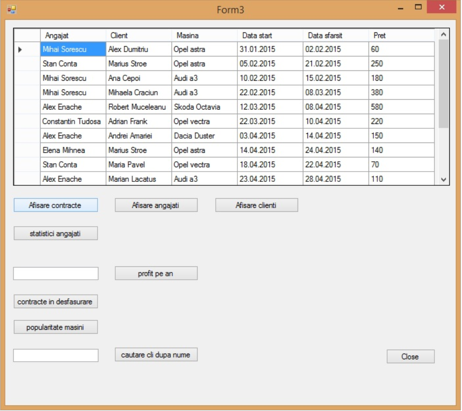

# rent-a-car

Proiect Baze de Date
Administrare Inchirieri Auto

Scopul acestei aplicatii este de a administra intr-un mod mai simplu datele corespunzatoare unei firme de inchirieri auto.
M-am folosit de cunostintele dobandite pe parcursul semestrului pentru a crea o baza de date cu urmatoarea structura:

Am creat apoi o aplicatie dupa modelul prezentat la laborator, avand urmatoarea interfata grafica:

In prima forma am afisat datele despre masinile care pot fi date spre inchiriere  cu ajutorul unei vederi ( masiniview).
Datele sunt primite de la serverul Oracle prin intermediul referintei OracleDataAccess.
In josul formei este present un group box, a carui scop este de a edita, actualiza sau sterge campurile aflate in tabelul Masini.
Actualizarea marcii, combustibilului si a disponibilitatii se face prin combobox-uri, incarcate cu datele de la celelalte tabele.

In a doua forma, deschisa la apasarea butonului “Formulare Adaugare” se pot introduce date in tabele (angajati, client si masini).
Pentru incrementarea cheii primare am folosit secvente.

In a 3-a forma am folosit un control datagridview pentru a afisa rezultatele unor interogari pe care le-am considerat a fi utile, precum:

a)statistici angajati, ce cuprinde numarul de contracte incheiate in total, precum si profitul total si mediu adus companiei : 
select angajat, count (*) contracte_incheiate,sum(pret) profit, round(avg(pret)) profit_mediu from contracteview group by angajat

b)afisarea profitului total intr-un anumit an, introdus de utilizator
“select SUM( pret ) from contractesi where to_char (data_start, 'yyyy') = " + txtAn.Text;

c)afisarea contractelor care se afla in desfasurare 
select * from contracteview where id_contract = (select id_contract from contractesi where data_sfarsit >= TRUNC(SYSDATE))

d)afisarea tuturor contractelor incheiate prin intermediul unei vederi:
create or replace view contracteview as
select con.id_contract,
CONCAT(CONCAT (ang.nume, ' '), ang.prenume)  ANGAJAT ,
CONCAT(CONCAT (cli.nume, ' '), cli.prenume) CLIENT,
CONCAT(CONCAT (mas.marca, ' '), mas.model) MASINA,
con.Data_start AS" DATA START", 
con.Data_sfarsit AS " DATA SFARSIT" ,
con.pret
FROM AngajatiSI ang, ClientiSI cli, MasiniSI mas, ContracteSI con
where con.ID_client = cli.ID_client AND con.ID_angajat = ang.ID_angajat AND con.ID_masina = mas.ID_masina

e) afisare masinile care au fost inchiriate cel putin o data 
select masina, count (*) popularitate  from contracteview group by masina

